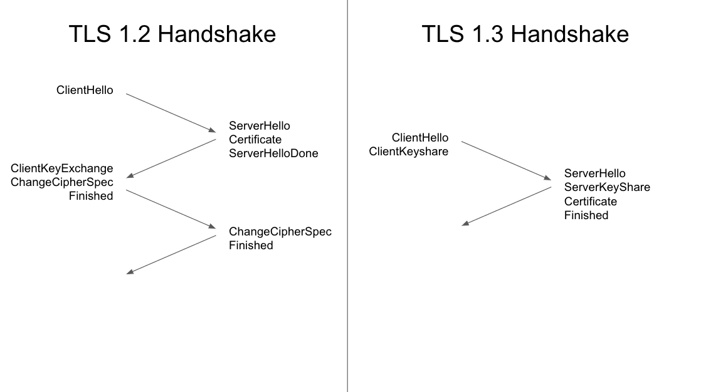

# 浏览器工作原理

## 概览

快速响应的网站提供更好的用户体验。用户期待内容快速加载和流畅交互的 Web 体验。

导致 Web 性能问题的原因主要有两种，一是网络延迟，二是大部分情况下的浏览器单线程执行。

保障页面快速加载的最大威胁是网络延迟。开发者的目标是使网站加载速度尽可能快，或者至少看起来加载速度很快，以便用户尽快获取所需信息。网络延迟是将字节传输到计算机的时间。Web 性能优化需要做的就是使页面尽可能快地加载完成。

大部分情况下，浏览器被认为是单线程的。也就是说，它们在执行一个任务之前会从头到尾完成一个任务，然后才会接受另一个任务。为了实现流畅的交互，开发者的目标是确保网站的交互性能良好，从流畅的滚动到对触摸的响应。渲染时间非常关键，我们需要确保主线程能够完成交给它的所有工作，并且始终能够处理用户交互。通过理解浏览器的单线程特性，并尽可能和适当地减少主线程的责任，可以提高网页性能，以确保渲染流畅，并且对交互的响应是即时的。

## 导航

导航是加载 web 页面的第一步。Web 性能优化的目标之一就是缩短导航完成所花费的时间，在理想情况下，它通常不会花费太多的时间，但是网络延迟和带宽会让它变久。

### DNS 查询

1. 发起请求
   当你在浏览器中输入一个域名（例如`www.example.com`）并按下回车时，DNS 查询过程就开始了。你的设备（称为“客户端”）需要找到这个域名对应的 IP 地址，以便与目标服务器建立连接。
2. 检查本地缓存

   - 操作系统缓存：首先，客户端会检查操作系统的 DNS 缓存（例如 Windows 的 hosts 文件或系统的缓存）。如果之前访问过这个域名且缓存未过期，系统会直接返回缓存中的 IP 地址。
   - 浏览器缓存：现代浏览器（如 Chrome、Firefox）也会维护自己的 DNS 缓存。如果缓存中有匹配的记录，查询到此结束。
     如果本地缓存中没有记录，查询会继续。

3. 请求本地 DNS 解析器（递归解析器）
   客户端会将查询请求发送到本地 DNS 解析器（也叫递归解析器）。这个解析器通常由你的互联网服务提供商（ISP）提供，或者你手动配置的公共 DNS 服务（如 Google 的 8.8.8.8 或 Cloudflare 的 1.1.1.1）。
   递归解析器的任务是为客户端完成整个查询过程，并返回最终的 IP 地址。它会从头到尾处理查询，因此客户端无需直接与外部 DNS 服务器交互。
4. 检查递归解析器的缓存
   递归解析器收到请求后，会先检查自己的缓存。如果它之前已经解析过`www.example.com`且记录未过期（由 TTL，即“生存时间”决定），它会直接返回 IP 地址给客户端，查询结束。
   如果缓存中没有记录，递归解析器会启动外部查询。
5. 根域名服务器（Root Servers）
   递归解析器从根域名服务器开始查询。根服务器是 DNS 体系的顶层，全球有 13 组（由 A 到 M 标记，例如 a.root-servers.net），由 ICANN 管理。

   - 递归解析器发送请求：“请告诉我`www.example.com`的 IP 地址。”
   - 根服务器不会直接知道具体 IP，但它知道顶级域名（TLD，如.com、.org）的服务器地址。它会返回一个响应：“我不知道具体 IP，但你可以去问.com TLD 服务器。”

   根服务器的地址通常预配置在递归解析器中，因此这一步不需要额外查询。

6. 顶级域名服务器（TLD Servers）
   递归解析器根据根服务器的指引，向对应的顶级域名服务器（TLD 服务器）发送查询。以`www.example.com`为例，它会联系.com TLD 服务器。

   - 请求：“请告诉我`www.example.com`的 IP 地址。”
   - TLD 服务器也不知道具体 IP，但它知道 example.com 这个域名的权威名称服务器（Authoritative Name Server）。它会返回：“去问 example.com 的权威服务器吧，这是它们的地址。”

7. 权威名称服务器（Authoritative Name Servers）
   递归解析器接着联系 example.com 域名的权威名称服务器。这些服务器由域名所有者或其 DNS 服务提供商（如 Cloudflare、AWS Route 53）维护，存储了该域名及其子域名的实际 DNS 记录。

   - 请求：“请告诉我`www.example.com`的 IP 地址。”
   - 权威服务器查找其记录（通常是一个 A 记录或 AAAA 记录，分别对应 IPv4 和 IPv6 地址），然后返回：“`www.example.com`的 IP 是`192.0.2.1`。”

8. 返回结果并缓存

   - 递归解析器收到权威服务器的响应（例如 192.0.2.1），将其缓存下来（根据 TTL 时间），以便下次查询时无需重复整个过程。
   - 然后，递归解析器将这个 IP 地址返回给客户端。

9. 客户端连接目标服务器
   客户端（你的设备）拿到 IP 地址后，通过网络协议（如 TCP/IP）与目标服务器（192.0.2.1）建立连接。这时，浏览器就可以加载网页内容了。

### DNS 查询类型

#### **1. 递归查询（Recursive Query）**

**定义:**

在递归查询中，DNS 客户端要求 DNS 服务器（通常是递归解析器）完全负责解析请求的域名，并返回最终结果。递归解析器要么返回所请求的资源记录（如 IP 地址），要么在无法找到记录时返回错误消息。

**工作原理:**

- **客户端角色**：客户端只需发起一次查询，之后将所有解析任务交给递归解析器。
- **递归解析器角色**：
  1. 接收客户端的查询请求（如解析 `www.example.com`）。
  2. 检查本地缓存是否有该记录。
  3. 如果缓存中没有，则从根服务器开始，逐步查询整个 DNS 层级，直到找到目标记录或确认记录不存在。
  4. 将最终结果（IP 地址或错误）返回给客户端。
- **例子**：

  - 客户端查询 `www.example.com`。
  - 递归解析器依次联系：
    - 根服务器（`.`）→ 返回 `.com` 的顶级域名服务器地址。
    - `.com` 顶级域名服务器 → 返回 `example.com` 的权威服务器地址。
    - `example.com` 权威服务器 → 返回 `www.example.com` 的 IP 地址。
  - 最后，递归解析器将 IP 地址返回给客户端。

**关键特点:**

- **客户端简单**：只需一次查询，解析器承担所有后续工作。
- **服务器负担重**：递归解析器需要完成整个查询链，消耗更多资源。
- **典型场景**：家庭网络或企业网络中的终端设备（如电脑、手机）通常使用递归查询，依赖 ISP 的 DNS 服务器。

---

#### **2. 迭代查询（Iterative Query）**

**定义:**

在迭代查询中，DNS 客户端允许 DNS 服务器返回其能提供的最佳答案。如果服务器不知道完整答案，它会返回一个指向更接近答案的 DNS 服务器的引用（Referral）。客户端需要根据这些引用逐步查询，直到找到最终记录或失败。

**工作原理:**

- **客户端角色**：客户端主动发起多次查询，逐步逼近目标。
- **服务器角色**：每次只返回当前已知的“最佳答案”，通常是一个指向更低级别权威服务器的地址。
- **例子**：
  - 客户端查询 `www.example.com`：
    1. 问本地 DNS 服务器，本地服务器无记录，返回根服务器地址。
    2. 客户端问根服务器，根服务器返回 `.com` 顶级域名服务器地址。
    3. 客户端问 `.com` 服务器，返回 `example.com` 的权威服务器地址。
    4. 客户端问 `example.com` 权威服务器，得到 `www.example.com` 的 IP 地址。
- **查询链**：客户端自己沿着这条链走下去，直到解析完成或超时/出错。

**关键特点:**

- **客户端复杂**：需要多次发起查询，处理引用逻辑。
- **服务器负担轻**：每个服务器只负责回答自己知道的部分，不参与完整解析。
- **典型场景**：递归解析器在与权威服务器交互时，内部通常使用迭代查询，而不是再次递归。

---

#### **3. 非递归查询（Non-Recursive Query）**

**定义:**

非递归查询发生在 DNS 客户端查询一个 DNS 服务器时，该服务器要么对请求的记录具有权威性（即直接管理该域名），要么该记录已存在于其缓存中。服务器直接返回答案，无需进一步查询其他服务器。

**工作原理:**

- **客户端角色**：发起查询，期待立即得到完整答案。
- **服务器角色**：
  1. 检查自己是否是所查询域名的权威服务器，或者缓存中是否有记录。
  2. 如果有，直接返回记录；如果没有，返回错误或空响应。
- **例子**：
  - 客户端查询 `www.example.com`，直接问 `example.com` 的权威服务器。
  - 权威服务器返回 `www.example.com` 的 IP 地址，无需再查其他服务器。
  - 或者，本地 DNS 服务器缓存了 `www.example.com` 的记录，直接返回缓存结果。

**关键特点:**

- **高效**：只需一次查询，响应速度快。
- **前提**：服务器必须有权威性或缓存记录。
- **典型场景**：缓存命中时（如访问热门网站），或客户端直接查询权威服务器。

**缓存的作用:**

- DNS 服务器通常会缓存查询结果（基于 TTL，Time To Live），减少对上游服务器的请求。
- 缓存是非递归查询高效的重要原因，也降低了网络带宽消耗和权威服务器的负载。

---

### **三者的对比与联系**

| **特性**       | **递归查询**            | **迭代查询**           | **非递归查询**     |
| -------------- | ----------------------- | ---------------------- | ------------------ |
| **客户端负担** | 低（一次查询）          | 高（多次查询）         | 低（一次查询）     |
| **服务器负担** | 高（完整解析）          | 低（只提供引用）       | 低（直接回答）     |
| **查询次数**   | 客户端 1 次，解析器多次 | 客户端多次             | 客户端 1 次        |
| **典型发起者** | 终端用户设备            | 递归解析器内部         | 客户端或缓存命中   |
| **结果**       | 完整记录或错误          | 最佳答案（可能是引用） | 权威记录或缓存记录 |

#### **协作关系**

- **实际解析过程**：当用户通过浏览器访问网站时，通常是这样的：
  1. 浏览器发起**递归查询**给本地递归解析器。
  2. 递归解析器使用**迭代查询**与根服务器、顶级域名服务器、权威服务器交互。
  3. 如果某个服务器的缓存命中或具有权威性，则返回**非递归查询**的结果。
- **分工明确**：递归查询让客户端省心，迭代查询让服务器分工协作，非递归查询优化效率。

## TCP 握手

一旦获取到服务器 IP 地址，浏览器就会通过 TCP“三次握手”与服务器建立连接。这个机制的是用来让两端尝试进行通信——在浏览器和服务器通过上层协议 HTTPS 发送数据之前，可以协商网络 TCP 套接字连接的一些参数。

TCP 的“三次握手”技术经常被称为“SYN-SYN-ACK”——更确切的说是 SYN、SYN-ACK、ACK——因为通过 TCP 首先发送了三个消息进行协商，然后在两台电脑之间开始一个 TCP 会话。是的，这意味着当请求尚未发出的时候，终端与每台服务器之间还要来回多发送三条消息。

## TLS 协商

对于通过 HTTPS 建立的安全连接，还需要另一次 "握手"。TLS 连接是通过一个称为 TLS 握手的流程启动的。当用户导航到一个使用 TLS 的网站时，用户设备（也称为客户端设备）和 Web 服务器之间开始 TLS 握手。

在 TLS 过程中，用户设备和 Web 服务器：

- 指定将要使用的 TLS 版本（TLS 1.0、1.2、1.3 等）
- 决定将要使用哪些密码套件（见下文）
- 使用服务器的 TLS 证书验证服务器的身份
- 握手完成后，生成会话密钥用于加密两者之间的消息

TLS 握手为每个通信会话建立一个密码套件。密码套件是一组算法，其中指定了一些细节，例如哪些共享加密密钥（即会话密钥）将用于该特定会话。TLS 也能在一个未加密的通道上设置匹配的会话密钥，这要归功于一种称为公钥加密的技术。

握手还处理身份验证，其中通常包括服务器向客户端证明其身份。这是通过使用公钥来完成的。公钥是使用单向加密的加密密钥，即任何拥有公钥的人都可以解读使用服务器私钥加密的数据，以确保其真实性，但只有源发送方才可以使用私钥加密数据。服务器的公钥是其 TLS 证书的一部分。

数据完成加密和验明身份后，使用消息身份验证码（MAC）进行签名。接收方然后可以验证 MAC 来确保数据的完整性。

### 性能影响

TLS 的最新版本对 Web 应用的性能几乎没有任何影响。  
由于建立 TLS 连接涉及到的复杂过程，因此必须花费一些加载时间和计算能力。在传输任何数据之前，客户端和服务器必须来回通信几次，这将占用 Web 应用宝贵的几毫秒加载时间，以及客户端和服务器的一些内存。  
然而，目前已有技术帮助缓解 TLS 握手造成的延迟。其一是 TLS 虚假启动（False Start），让服务器和客户端在 TLS 握手完成前开始传输数据。另一种加速 TLS 的技术是 TLS 会话恢复，允许之前通信过的客户端和服务器简化握手过程。  
这些改良帮助 TLS 成为一种非常快速的协议，不会明显影响加载时间。至于与 TLS 相关的计算成本，以今天的标准来看几乎可以忽略不计。  
2018 年发布的 TLS 1.3 进一步提高了 TLS 的速度。TLS 1.3 中的 TLS 握手仅需要一次往返（即来回通信），而不是以前的两次，将握手过程所需时间缩短了几毫秒。如果用户以前已连接过网站，TLS 握手的往返次数为零，从而进一步加快了速度。



## 响应

一旦我们建立了和 web 服务器的连接，浏览器就会代表用户发送一个初始的 HTTP GET 请求，对于网站来说，这个请求通常是一个 HTML 文件。一旦服务器收到请求，它将使用相关的响应头和 HTML 的内容进行回复。
初始请求的响应包含所接收数据的第一个字节。首字节时间（TTFB）是用户通过点击链接进行请求与收到第一个 HTML 数据包之间的时间。第一个内容分块通常是 14KB 的数据。

### 拥塞控制 / TCP 慢启动

在传输过程中，TCP 包被分割成段。由于 TCP 保证了数据包的顺序，因此服务器在发送一定数量的分段后，必须从客户端接收一个 ACK 包的确认。

如果服务器在发送每个分段之后都等待 ACK，那么客户端将频繁地发送 ACK，并且可能会增加传输时间，即使在网络负载较低的情况下也是如此。

另一方面，一次发送过多的分段会导致在繁忙的网络中客户端无法接收分段并且长时间地只会持续发送 ACK，服务器必须不断重新发送分段的问题。

为了平衡传输分段的数量，TCP 慢启动算法用于逐渐增加传输数据量，直到确定最大网络带宽，并在网络负载较高时减少传输数据量。

传输段的数量由拥塞窗口（CWND）的值控制，该值可初始化为 1、2、4 或 10 MSS（以太网协议中的 MSS 为 1500 字节）。该值是发送的字节数，客户端收到后必须发送 ACK。

如果收到 ACK，那么 CWND 值将加倍，这样服务器下次就能发送更多的数据分段。相反，如果没有收到 ACK，那么 CWND 值将减半。因此，这种机制在发送过多分段和过少分段之间取得了平衡。

### 14KB 的依据

“14KB”依据来源于早期 Web 性能优化领域的经验规则，具体与 TCP 网络传输的初始拥塞窗口（Initial Congestion Window，简称 Initial CWND）和浏览器行为有关。

1. 在 TCP 协议中，数据传输采用“慢启动”（Slow Start）机制。发送方（如服务器）一开始不会一次性发送大量数据，而是从一个较小的初始拥塞窗口（Initial CWND）开始，逐步增加发送的数据量。在早期的互联网标准中（如 RFC 2581，1999 年），TCP 的初始拥塞窗口被建议设置为 2-4 个 MSS（Maximum Segment Size，最大分段大小）。MSS 通常由网络的最大传输单元（MTU）决定，默认情况下是以太网的 MTU 为 1500 字节，去掉 TCP 和 IP 头部（约 40 字节），MSS 约为 1460 字节。因此，初始拥塞窗口大约是 2 × 1460 = 2920 字节（约 3KB）到 4 × 1460 = 5840 字节（约 6KB）。

2. 在实际的 HTTP 请求中，浏览器通常在一个 TCP 连接的第一个往返（RTT，Round-Trip Time）中接收服务器返回的数据。这个数据量受限于初始拥塞窗口。为了提高性能，Web 优化专家（如 Steve Souders）在 2000 年代提出，服务器应该在第一个数据包中返回足够多的内容，让浏览器可以开始解析和渲染页面。当时的经验值逐渐演变为 14KB，因为：

   - 随着网络优化，初始拥塞窗口逐渐被调大到 10 个 MSS（约 14KB），特别是在 Google 的推动下（详见后文）。
   - 14KB 被认为是一个合理的折中值，既能容纳关键的 HTML 和 CSS，又不会超过大多数网络环境的初始传输能力。

3. 浏览器的确可以在接收到第一个数据分块后开始解析 HTML（增量解析），而无需等待整个响应完成。14KB 的经验规则源于这样一个假设：如果前 14KB 包含关键渲染路径所需的内容（HTML 结构和关键 CSS），浏览器就能尽早开始构建 DOM 和 CSSOM，从而减少“首次渲染时间”（First Contentful Paint, FCP）。

### 具体计算依据

1. 初始拥塞窗口的演变：
   在 2010 年，Google 提出了将初始拥塞窗口从 4 MSS 增加到 10 MSS 的建议（RFC 6928，2013 年正式标准化）。这意味着初始窗口从 6KB 左右增加到 10 × 1460 = 14,600 字节，约 14KB。
   14KB 因此成为 Web 性能优化中的一个关键数字，因为它代表了服务器在第一个 RTT 中可以无延迟发送的最大数据量。
2. HTTP 头部开销：
   HTTP 响应包括响应头（通常几百字节）和响应体。假设头部占用 400 字节，剩余约 14KB 可用于 HTML、CSS 等内容。
3. 浏览器缓冲区：
   浏览器通常会缓冲一定量的数据后再开始解析。14KB 接近早期浏览器的缓冲区大小，确保解析器有足够的数据开始工作。

浏览器的渲染过程需要 HTML（构建 DOM）、CSS（构建 CSSOM）和可能的 JavaScript。如果这些关键资源能在第一个数据包（14KB）内交付，浏览器可以更快地完成首次渲染。
如果 HTML 超过 14KB，浏览器可能需要额外的 RTT 来接收剩余数据，延迟渲染。

浏览器接收到 HTML 后的渲染解析过程是一个复杂且高度优化的流程，它将原始的 HTML 文本转化为用户可见的页面。这个过程涉及多个步骤，包括解析 HTML 构建 DOM、解析 CSS 构建 CSSOM、结合两者生成渲染树（Render Tree），以及后续的布局和绘制等阶段。以下是对这一过程的详细说明，按步骤展开：

## **HTML 解析与 DOM 树构建 （增量构建）**

HTML 解析的核心是将 HTML 文本转换为**文档对象模型（DOM，Document Object Model）**，这是浏览器对页面结构的内存表示。

1. **令牌化（Tokenization）**：

   - HTML 被分解为一个个“令牌”（Token），如开始标签（`<div>`）、结束标签（`</div>`）、文本内容等。
   - 浏览器使用状态机（State Machine）处理字符流，识别标签、属性和内容。
   - 示例：

     ```html
     <div class="container">Hello</div>
     ```

     被分解为：

     - 开始标签：`<div>`（属性：`class="container"`）
     - 文本：`Hello`
     - 结束标签：`</div>`

2. **DOM 树构建（Tree Construction）**：

   - 令牌被组织成树状结构，形成 DOM 树。
   - 规则：
     - 开始标签创建一个节点，放入树中。
     - 嵌套标签成为子节点。
     - 结束标签关闭当前节点。
   - 示例结果（简化的 DOM 树）：

   ```tsx
    Document
      └── div (class="container")
            └── Text: "Hello"
   ```

   - **容错性**：HTML 解析器对语法错误有很强的容错能力。例如，缺少闭合标签时，浏览器会尝试自动补全。

3. **遇到外部资源**：
   - **CSS 文件**：如 `<link rel="stylesheet" href="styles.css">`，浏览器发起并行请求下载 CSS，但不会阻塞 HTML 解析。
   - **JavaScript 文件**：如 `<script src="script.js">`，默认会暂停 HTML 解析，直到脚本下载并执行完成（除非使用 `async` 或 `defer` 属性）。
   - **图片**：如 ``，异步加载，不阻塞解析。

**关键点：**

- **预加载扫描（Preload Scanner）**：现代浏览器（如 Chrome）会运行一个额外的扫描器，提前发现外部资源并发起请求，优化加载速度。
- **增量解析**：每接收到一部分 HTML，解析器就更新 DOM 树，无需等待全部数据。

## CSS 解析与 CSSOM 构建

与此同时，如果 HTML 中引入了 CSS（如 `<link>` 或 `<style>`），浏览器会解析这些样式，构建**CSS 对象模型（CSSOM，CSS Object Model）**。

1. **CSS 下载**：
   - 浏览器根据 `<link>` 或内联 `<style>` 获取 CSS 内容。
2. **令牌化与解析**：

   - CSS 文本被分解为规则块，如选择器（`div`）、属性（`color: blue`）等。
   - 示例：

     ```css
     div.container {
       color: blue;
       font-size: 16px;
     }
     ```

     被解析为：

     - 选择器：`div.container`
     - 属性：`color: blue`, `font-size: 16px`

3. **CSSOM 树构建**：

   - CSS 规则被组织成树状结构，与 DOM 树对应。
   - CSSOM 表示每个 DOM 节点的样式信息。
   - 示例结果（简化的 CSSOM）：

     ```tsx
     CSSStyleSheet
       └── Rule
           ├── Selector: "div.container"
           └── Declarations: { color: blue, font-size: 16px }
     ```

**关键点：**

- **阻塞性**：CSSOM 的构建会阻塞渲染，因为浏览器需要知道元素的样式才能绘制页面，所以在 CSSOM 完成之前无法渲染内容。
- **层叠与优先级**：浏览器计算 CSS 规则的优先级（基于选择器特异性、顺序和 `!important`），最终确定每个节点的样式。

## 渲染树（Render Tree）生成

DOM 和 CSSOM 构建完成后，浏览器将两者结合，生成**渲染树**，这是实际用于渲染的结构。

1. **合并 DOM 和 CSSOM**：
   - 遍历 DOM 树，为每个节点应用匹配的 CSSOM 规则。
   - 只包含**可见元素**（如 `display: none` 的节点被排除）。
2. **渲染树结构**：

   - 每个节点包含几何信息（如位置、大小）和绘制信息（如颜色、边框）。
   - 示例：

     ```tsx
     RenderObject (div.container)
       ├── Style: { color: blue, font-size: 16px }
       └── Child: RenderText ("Hello")
     ```

**关键点：**

- **优化**：不可见元素（如 `<head>`、`<meta>`）不进入渲染树，减少计算开销。
- **动态性**：如果 JavaScript 修改了 DOM 或 CSSOM，渲染树会随之更新。

## **布局（Layout / Reflow）**

渲染树生成后，浏览器计算每个元素在页面中的具体位置和大小。

1. **坐标计算**：
   - 从根节点（通常是 `<html>`）开始，递归计算每个节点的宽度、高度、边距、位置等。
   - 使用盒模型（Box Model）确定内容区、内边距、边框和外边距。
2. **流式布局**：
   - 根据 CSS 属性（如 `float`、`position`）安排元素。
   - 示例：`div.container` 的位置基于其父元素和兄弟元素。

布局性能受 DOM 影响——节点数越多，布局就需要更长的时间。如果在滚动或其他动画过程中需要布局，布局可能会成为一个瓶颈，从而导致卡顿。20ms 的延迟在加载或者方向改变时或许还可以接受，但在动画或滚动时就会变得卡顿。任何渲染树改变的时候，像添加节点、改变内容或者在一个节点更新盒模型样式的时候就会开始布局。

为了减小布局事件的频率和时长，我们应该批量更新或者避免改动盒模型属性。

**关键点：**

- **视口依赖**：布局结果依赖浏览器窗口大小（Viewport）。
- **重排（Reflow）**：窗口缩放或 DOM 修改可能触发重新布局，消耗性能。

## 绘制（Painting）

布局完成后，浏览器将渲染树转换为屏幕上的像素。

1. **绘制指令**：
   - 将渲染树的每个节点转换为绘制操作（如填充矩形、绘制文本）。
   - 示例：`div.container` 被绘制为蓝色文字 “Hello”。
2. **分层**：
   - 浏览器将页面分成多个层（如背景、前景），便于后续优化。
3. **光栅化（Rasterization）**：
   - 将绘制指令转为位图，由 GPU 或 CPU 执行。

**关键点：**

- **性能优化**：GPU 加速（如硬件加速的 CSS 动画）提高绘制效率。
- **重绘（Repaint）**：样式变化（如颜色改变）可能触发部分重绘。

---

## 合成（Compositing）

现代浏览器（如 Chrome）使用合成技术，将分层内容组合成最终画面。

1. **层管理**：
   - 独立的层（如固定定位元素）单独处理。
2. **合成**：
   - GPU 将所有层合并，生成最终屏幕显示。

**关键点：**

- **高效更新**：仅更新变化的层，避免全局重绘。
- **硬件加速**：CSS 属性如 `transform` 或 `opacity` 会触发合成优化。

## **关键特性与优化**

- **增量渲染**：浏览器边解析边渲染，减少白屏时间。
- **并发解析与预加载**: 在解析 HTML 时提前发现资源（如图片、脚本），并发请求以缩短加载时间。
- **滚动优化**：合成线程独立处理滚动事件，无需主线程参与，滚动更流畅。
- **阻塞点**：
  - CSS 阻塞渲染（需等待 CSSOM）。
  - 同步 JavaScript 阻塞解析（需执行完成）。
- **性能优化建议**：
  - 减少关键资源大小（如前 14KB 包含关键 HTML/CSS）。
  - 使用 `async`/`defer` 加载脚本。
  - 内联关键 CSS，异步加载非关键资源。
  - 合并 DOM 和样式操作
  - 通过 transform 和 opacity 跳过布局与绘制,或者添加 `will-change` 或伪 3D 属性触发硬件加速。
  - 避免强制同步布局，分离读写操作。

## 交互

一旦主线程绘制页面完成，你会认为我们已经“准备好了”，但事实并非如此。如果加载包括正确延迟加载的 JavaScript，并且仅在 onload 事件触发后执行，那么主线程可能会忙于执行脚本，无法用于滚动、触摸和其他交互操作。

可交互时间（TTI）是测量从第一个请求导致 DNS 查询和 SSL 连接到页面可交互时所用的时间——可交互是在首次内容绘制之后页面在 50ms 内响应用户的交互。如果主线程正在解析、编译和执行 JavaScript，则无法及时（小于 50ms）响应用户交互。

在我们的示例中，可能图像加载很快，但 anotherscript.js 文件的大小可能是 2MB，而且用户的网络连接很慢。在这种情况下，用户可以非常快地看到页面，但是在下载、解析和执行脚本之前，就无法滚动。这不是一个好的用户体验。避免占用主线程，如下面的网页测试示例所示：
