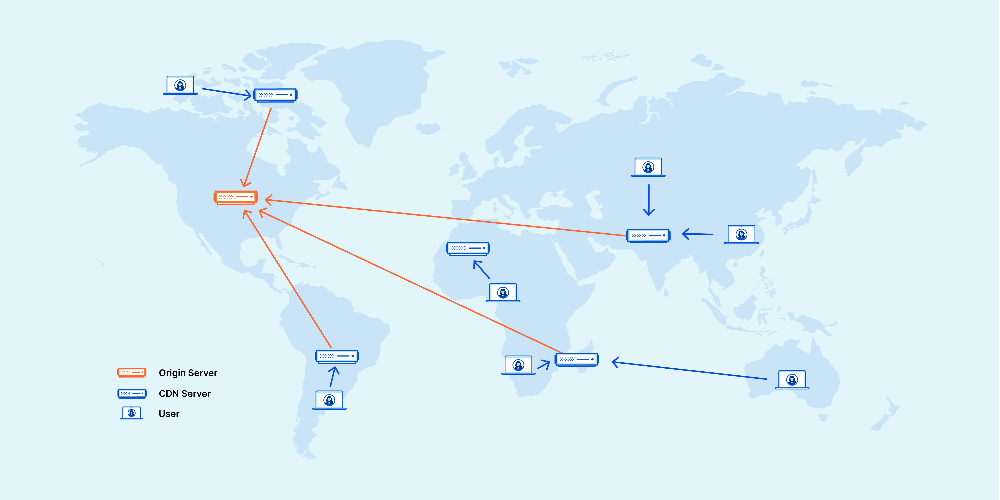
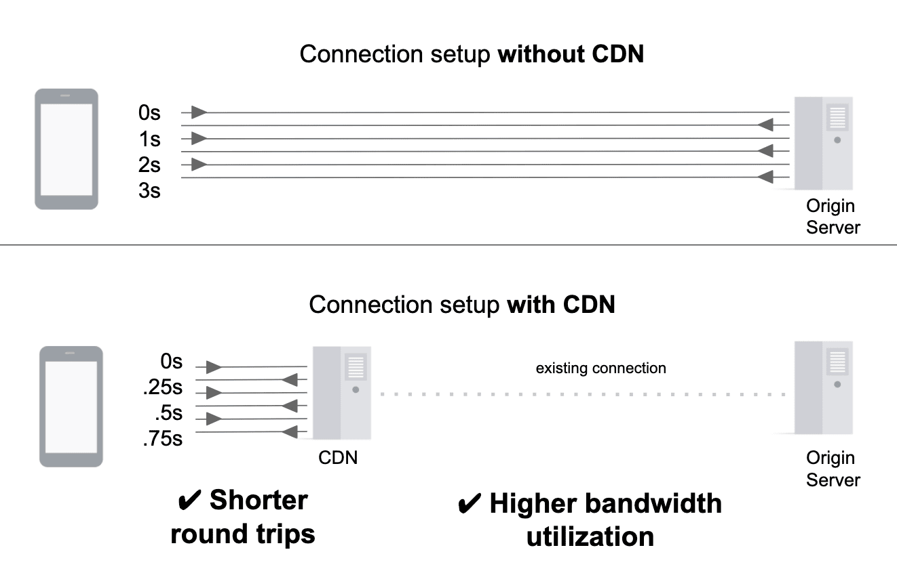
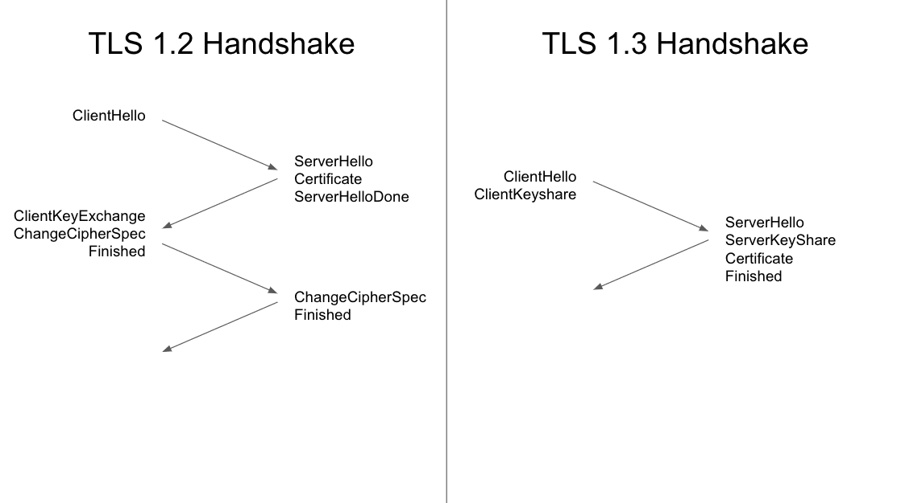

# 内容分发网络 (CDN)

## 概览

内容分发网络 (CDN) 是一个分布在不同地理位置的服务器群，用于缓存靠近最终用户的内容。CDN 可以快速传输加载互联网内容所需的资产，包括 HTML 网页、JavaScript 文件、样式表、图像和视频。
正确配置的 CDN 还可帮助保护网站免受某些常见的恶意攻击，例如分布式拒绝服务（DDOS）攻击。

主要好处可以分为以下四个不同的部分：

1. 缩短网站加载时间 – 通过将内容分发到访问者附近的 CDN 服务器（以及其他优化措施），访问者体验到更快的页面加载时间。由于访问者更倾向于离开加载缓慢的网站，CDN 可以降低跳出率并增加人们在该网站上停留的时间。换句话说，网站速度越快，用户停留的时间越长。
2. 减少带宽成本 – 网站托管的带宽消耗成本是网站的主要费用。通过缓存和其他优化，CDN 能够减少源服务器必须提供的数据量，从而降低网站所有者的托管成本。
3. 增加内容可用性和冗余 – 大流量或硬件故障可能会扰乱正常的网站功能。由于 CDN 具有分布式特性，因此与许多源服务器相比，CDN 可以处理更多流量并更好地承受硬件故障。
4. 改善网站安全性 – CDN 可以通过提供 DDoS 缓解、安全证书（TLS 证书，也称 SSL）的改进以及其他优化措施来提高安全性。

## 如何工作？

CDN 的核心是一个服务器网络，目的是尽可能快速、便宜、可靠和安全地交付内容。为了提高速度和连接性，CDN 会将服务器放置在不同网络之间的交换点。这些互联网交换点（IXP）是不同互联网提供商连接的主要位置，以便彼此提供对来自其不同网络的流量的访问。通过连接到这些高速且高度互连的位置，CDN 提供商可以减少高速数据传输中的成本和传输时间。

除了在 IXP 中放置服务器，CDN 还对标准客户端/服务器数据传输进行了诸多优化。 CDN 将数据中心放置在全球的战略位置，增强安全性，并设计成可承受各种类型的故障和互联网拥塞。

### 改善延迟

在网站加载内容方面，隨着网站速度变慢，用户数量会迅速减少。 CDN 服务可以通过以下方式帮助减少加载时间：

- CDN 的全球分布性可缩短用户与网站资源之间的距离。CDN 使得用户不必连接到网站源服务器的所在地，而是连接到一个地理位置更近的数据中心。更少的传输时间意味着更快的服务。
- 硬件和软件优化，例如有效的负载均衡和固态硬盘驱动器(SSD)，可以帮助数据更快地到达用户。
- CDN 可以使用最小化和文件压缩之类的策略来减小文件大小，从而减少传输的数据量。较小的文件意味着更快的加载时间。
- CDN 还可以通过优化连接重用和启用 TLS 假启动来加速使用 TLS/SSL 的站点。

### 可靠性和和冗余

对于拥有互联网资产的任何人来说，正常运行时间都是至关重要的组成部分。恶意攻击或只是受欢迎程度增加所致的硬件故障和流量激增，都有可能使 Web 服务器停机并阻止用户访问站点或服务。完善的 CDN 具备一些可最大程度减少停机时间的功能：

- 负载均衡可在多个服务器之间平均分配网络流量，从而更容易适应流量的快速增长。
- 即使一台或多台 CDN 服务器由于硬件故障而脱机，智能故障切换也可提供不间断的服务；故障转移可以将流量重新分配给其他正常运行的服务器。
- 如果整个数据中心都遇到技术问题，那么 Anycast 路由会将流量转移到另一个可用的数据中心，以确保所有用户都能继续访问网站。

## CDN 资源分发

使用 CDN 来分发资源（即使是无法缓存的资源）通常比让用户从您的服务器“直接”加载资源更快。使用 CDN 从来源分发资源时，客户端和附近的 CDN 服务器之间会建立新的连接。历程的其余部分（即 CDN 服务器与源站之间的数据传输）通过 CDN 网络进行，该网络通常包括与源站的现有持久连接。

这样做有两方面的好处：

1. 在尽可能靠近用户的位置终止新连接可以避免不必要的连接设置成本（建立新连接成本高昂，并且需要多次往返）；
2. 使用预热连接可以立即以尽可能高的吞吐量传输数据。

某些 CDN 在这一点上进一步改进，通过分布在互联网上的多个 CDN 服务器将流量路由到源站。CDN 服务器之间的连接是通过高度优化的可靠路由进行的，而不是通过
[边界网关协议 (BGP)](https://en.wikipedia.org/wiki/Border_Gateway_Protocol)确定的路由。虽然 BGP 是互联网实际上的路由协议，但其路由决策并不总是以性能为导向。因此，BGP 确定的路由的性能可能不如 CDN 服务器之间微调的路由。

## CDN 缓存

通过缓存 CDN 服务器上的资源，您无需将请求直接传送至源站以供传送。因此，资源的交付速度更快；这也减轻了源服务器的负载。

### 将资源添加到缓存

填充 CDN 缓存的最常用方法是让 CDN 根据需要“拉取”资源，这称为“源拉取”。首次从缓存中请求特定资源时，CDN 将从源服务器请求该资源并缓存响应。通过这种方式，当有其他未缓存的资源被请求时，缓存的内容会随着时间的推移而积累。

### 从缓存中移除资源

CDN 使用缓存逐出功能定期从缓存中移除没用的资源。此外，网站所有者可以使用完全清除功能来明确移除资源。

- 缓存逐出

  缓存的存储空间容量有限。当缓存即将用尽容量时，它会移除最近未访问过的资源或占用大量空间的资源，从而为新资源腾出空间。此过程称为缓存逐出。某个资源从一个缓存中逐出并不一定意味着它已从 CDN 网络的所有缓存中逐出。

- 完全清除

  清除（也称为“缓存失效”）是一种将资源从 CDN 的缓存中移除的机制，无需等待该资源过期或被逐出。它通常通过 API 执行。在需要撤消内容的情况下（例如，更正拼写错误、定价错误或错误的新闻报道），完全清除功能至关重要。此外，它还可以在网站的缓存策略中起到至关重要的作用。

  如果 CDN 支持近乎即时完全清除，则可将完全清除用作一种管理动态内容缓存的机制：使用长 TTL 缓存动态内容，然后在资源更新时完全清除资源。通过这种方式，即使事先不知道资源何时将发生变化，也可以最大限度地延长动态资源的缓存时长。此技术有时称为“暂停付款”缓存。

  在大规模使用时，完全清除操作通常与称为“缓存标记”或“代理缓存键”的概念结合使用。利用这种机制，网站所有者可以将一个或多个其他标识符（有时称为“代码”）与缓存的资源相关联。这些代码随后可用于执行高度细化的完全清除。例如，您可以向包含网站页脚的所有资源（例如 /about、/blog）添加“footer”标记。页脚更新后，指示您的 CDN 完全清除与“footer”标记关联的所有资源。

### 可缓存的资源

是否应缓存资源以及如何缓存资源，取决于该资源是公共资源还是私有资源；是静态资源还是动态资源。

#### 私有资源和公开资源

- 私有资源

  私有资源包含面向单个用户的数据，因此不应由 CDN 进行缓存。专用资源由 `Cache-Control: private` 标头指示。

- 公共资源

  公共资源不包含用户特定信息，因此可由 CDN 缓存。如果某项资源没有 `Cache-Control: no-store` 或 `Cache-Control: private` 标头，则 CDN 可能会将其视为可缓存的资源。公开资源可缓存的时间长度取决于该资源的更改频率。

#### 动态和静态内容

- 动态内容

  动态内容是指频繁变动的内容。此类内容的示例包括 API 响应和商店首页。不过，此内容频繁更改，并不一定会阻止系统对其进行缓存。在流量大的时段，将这些响应缓存很短的时间（例如 5 秒）可以显著减少源服务器的负载，同时对数据新鲜度的影响微乎其微。

- 静态内容

  静态内容不会经常更改（如果有）。此类内容通常包括图片、视频和版本化库。由于静态内容不会发生变化，因此应采用较长的生存时间 (TTL) 进行缓存，例如 6 个月或 1 年。

## POP 边缘缓存

概括来讲，您可以在最大限度地缩短延迟时间和最大限度提高缓存命中率之间的权衡来考虑 CDN 的性能策略。具有许多入网点 (PoP) 的 CDN 可以提供较低的延迟，但由于流量在更多缓存中拆分，因此缓存命中率可能会较低。相反，PoP 较少的 CDN 可能在地理位置上距离用户较远，但可以实现更高的缓存命中率。

由于这种权衡，一些 CDN 使用分层方法进行缓存：靠近用户的 PoP（也称为“边缘缓存”）以具有较高缓存命中率的中央 PoP 作为补充。当边缘缓存找不到某个资源时，会向中央 PoP 寻找该资源。这种方法的代价是延迟时间略长，但增加了从 CDN 缓存提供资源的可能性，但并不一定是边缘缓存。

最大限度地缩短延迟时间与最大限度提高缓存命中率之间的权衡是面面俱到的。没有哪一种方法是普遍适用的，不过，根据您网站的性质及其用户群，您可能会发现其中一种方法的效果明显优于另一种。

## 对 LCP 的影响

如本文前面所述，CDN 的主要目的是将资源分配到地理位置上更靠近用户的服务器，从而减少延迟时间。因此，CDN 的主要优势在于可以提高加载性能。特别是，在网站的服务器端架构中引入 CDN 后，资源的[第一字节时间 (TTFB)](https://web.dev/articles/ttfb?hl=zh-cn) 可以显著缩短。

虽然 TTFB 不是以[用户为中心的性能指标](https://web.dev/articles/user-centric-performance-metrics?hl=zh-cn)，但是诊断 L[argest Contentful Paint (LCP)](https://web.dev/articles/lcp?hl=zh-cn)（以用户为中心的指标）存在的问题的重要指标。

CDN 在改进 LCP 方面尤其有效，因为它们可以改进文档传送（通过减少连接设置和缓存文档中的 TTFB），并改善渲染 LCP 元素所需的任何静态资源的传送。

## 提高 CDN 缓存命中率

一个有效的 CDN 配置将从缓存中尽可能多地提供资源。这通常通过缓存命中率（CHR）来衡量。缓存命中率定义为在给定时间间隔内缓存命中次数除以总请求数量。

一个新初始化的缓存将具有 0 个 CHR，但随着缓存填充资源，这个数字会增加。对于大多数网站来说，90%的 CHR 是一个良好的目标。您的 CDN 提供商应向您提供有关您的 CHR 的分析和报告。

当优化 CHR 时，首先要验证所有可缓存的资源是否被缓存，并且缓存时间是否正确。这是一个所有网站都应该进行的简单评估。

## HTTP 缓存

CDN 缓存工作原理的简单解释是，资源的 URL 用作缓存的键，用于从缓存中检索资源。http 缓存是 CDN 的基本功能。CDN 将资源缓存在多个服务器上，并使用 HTTP 缓存标头（如 `Cache-Control` 和 `Expires`）来指示浏览器或 CDN 从缓存中获取资源。

使用最大合适的生存时间（TTL）缓存资源将避免未来不必要的源站获取，从而提高 CHR。

至少需要设置以下这些头部信息之一，以便资源能够被 CDN 缓存：

- `Cache-Control: max-age=`
- `Cache-Control: s-maxage=`
- `Expires`

此外，尽管这不会影响资源是否以及如何被 CDN 缓存，但设置 `Cache-Control: immutable` 指令也是一个好习惯。 `Cache-Control: immutable` 表示资源“在其新鲜度生命周期内不会更新”。因此，当浏览器从浏览器缓存中提供资源时，它不会重新验证该资源，从而消除不必要的服务器请求。不幸的是，此指令仅由 Firefox 和 Safari 支持——它不被基于 Chromium 的浏览器支持。

更多详细的信息，请参阅 [HTTP 缓存指南](https://developer.mozilla.org/zh-CN/docs/Web/HTTP/Caching_FAQ)。

:::warning
默认情况下，CDN 在缓存资源时会考虑查询参数。然而，对查询参数处理的小幅调整可能会对 CHR 产生重大影响。

1. 不必要的查询参数  
   默认情况下，CDN 会分别缓存 example.com/blog 和 example.com/blog?referral_id=2zjk ，即使它们可能是相同的底层资源。这可以通过调整 CDN 的配置来忽略 referral_id 查询参数来修复。
2. 查询参数顺序  
   CDN 将 example.com/blog?id=123&query=dogs 与 example.com/blog?query=dogs&id=123 分别缓存。对于大多数网站，查询参数的顺序并不重要，因此配置 CDN 对查询参数进行排序（从而规范化用于缓存服务器响应的 URL）将提高 CHR。

:::

## 资源压缩

所有基于文本的响应都应使用 gzip 或 Brotli 进行压缩。如果可以选择，请选择 Brotli 而不是 gzip。Brotli 是一种较新的压缩算法，与 gzip 相比，它可以实现更高的压缩比率。有两种类型的 Brotli 压缩 CDN 支持：“Brotli from origin”和“automatic Brotli compression”。

- Brotli from origin 是指 CDN 提供由源站 Brotli 压缩的资源。
- 自动 Brotli 压缩是指 CDN 对资源进行 Brotli 压缩。CDN 可以对可缓存和不可缓存的资源进行压缩。首次请求资源时，使用“足够好”的压缩方式提供服务 - 例如，Brotli-5。此类压缩适用于可缓存和不可缓存资源。同时，如果一个资源是可缓存的，CDN 将使用离线处理以更强大的但速度更慢的压缩级别压缩该资源 - 例如，Brotli-11。一旦压缩完成，更压缩的版本将被缓存并用于后续请求。

### 压缩最佳实践

网站希望最大化性能应在其源服务器和 CDN 上应用 Brotli 压缩。源服务器上的 Brotli 压缩最小化了无法从缓存中提供资源的资源传输大小。为防止请求服务延迟，源端应使用相当保守的压缩级别压缩动态资源 - 例如，Brotli-4；静态资源可以使用 Brotli-11 进行压缩。如果源站不支持 Brotli，可以使用 gzip-6 压缩动态资源；gzip-9 可以用于压缩静态资源。

## TLS1.3

:::tip
Netscape 开发了名为安全套接字层（Secure Socket Layer，SSL）的上一代加密协议，TLS 由此演变而来。TLS 1.0 版实际上最初作为 SSL 3.1 版开发，但在发布前更改了名称，以表明它不再与 Netscape 关联。由于这个历史原因，TLS 和 SSL 这两个术语有时会互换使用。
:::

TLS 1.3 是传输层安全性（TLS）的最新版本，是 HTTPS 使用的加密协议。TLS 1.3 相比 TLS 1.2 提供了更好的隐私性和性能。TLS 1.3 将 TLS 握手过程从两次往返缩短为一次。对于使用 HTTP/1 或 HTTP/2 的连接，将 TLS 握手过程缩短为一次往返，有效减少了连接建立时间 33%。

## 图片优化

CDN 图像优化服务通常专注于可以自动应用的图像优化，以减少图像传输大小。例如：去除 EXIF 数据、应用无损压缩以及将图像转换为较新的文件格式（例如，WebP）。图像占中位网页传输字节的约 50%，因此优化图像可以显著减小页面大小。

## 压缩

压缩移除 JavaScript、CSS 和 HTML 中的不必要的字符。建议在源服务器上而不是 CDN 上进行压缩。

网站所有者对要压缩的代码有更多了解，因此通常可以使用比 CDN 使用的更激进的压缩技术。然而，如果无法在源处压缩代码，通过 CDN 进行压缩是一个不错的选择。
